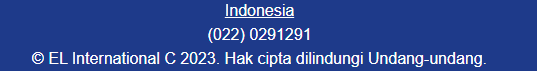

# language-course
<h1>menampilkan navbar</h1>

```HTML
<nav class="flex items-center p-5 bg-blue-100">
            
            <ul class="flex-1 text-center">
              <li class="list-none inline-block px-5">
                <a href="#home" class="no-underline">Home</a>
              </li>
              <li class="list-none inline-block px-5">
                <a href="#category" class="no-underline">Category</a>
              </li>
              <li class="list-none inline-block px-5">
                <a href="#features" class="no-underline">Features</a>
              </li>
              <li class="list-none inline-block px-5">
                <a href="#contact" class="no-underline">Contact</a>
              </li>
            </ul>
            
          </nav>
```


<b>Javascript</b>


saat Indonesia di klik akan membuka tab baru dan menampilkan peta indonesia

```JS
function newTab(){
    window.open("https://www.google.com/maps/d/viewer?mid=1Q-uN3MQXPcuXV03tWaLlxfadCyc&hl=in&ll=7.858365134663291%2C119.4397975&z=4")
}
```
## Cara Kerja Website
Website ini hanya berisi sebuah informasi mengenai kursus bahasa asing. Julukan yang digunakan oleh perusahan adalah easy learning. Untuk konten nya ada beberapa pilihan kategori kursus sesuai dengan usia kita atau customer.